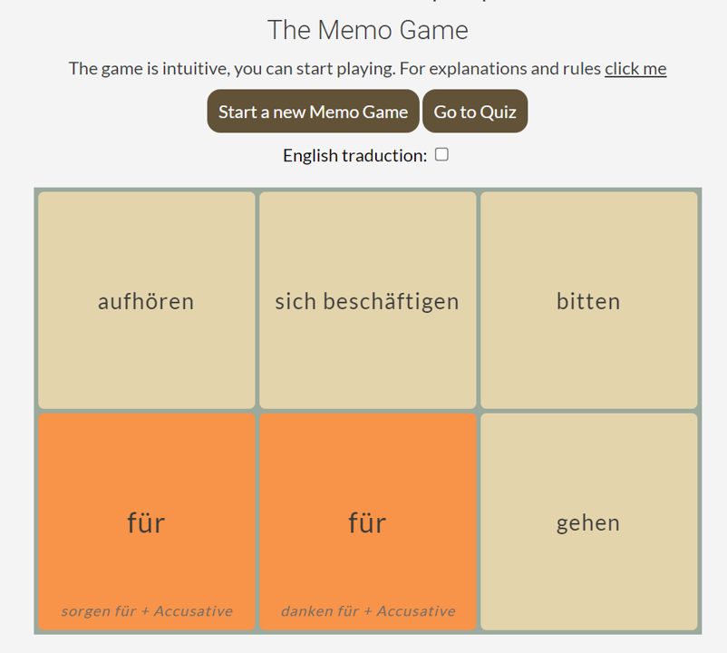

<h1 align="center"> Project 2 for Code Institute formation | German verbs with Prepositions - HTML & CSS & js</h1>

[View the live project here.](https://laurepiechaczyk.github.io/project2_code_institute/)

German verbs with Prepositions is a website built as part of a project for the [code institute](https://codeinstitute.net/) (training to become a web developer) to develop and show my skills in javascript. 

To do this, I created a game to learn German verbs with prepositions.

<h3 align="center"></h3>

# Table of content

Open the Table of Contents here

# About the project 
In order to practice, develop and demonstrate my HTML, CSS and particurlarly js skills, I created the responsive website German verbs with Prepositions. German verbs with Prepositions is a website with a game and a quizz to learn the German verbs with Prepositions.
I have chosen this topic because I am learning German myself.

## Background to understand the purpose of the game
As in English, some German verbs are followed by prepositions to give a certain meaning. These are called "verbs with prepositions". For example, "to wait for" would be "warten auf" in German.

It leads to the question: 
How can a person learning German learn which preposition goes with which verb?

## Idea behind the website to help learn German
To learn a language, repetition is the key and, in my opinion, boredom is the biggest obstacle.

It is thus important to find ways to avoid boredom and games can be very useful.

Another idea to develop this website is to learn by matching verbs using the same preposition.
Another idea to develop this website is to learn by matching verbs using the same preposition.

That's what this site is all about: Fun + matching verbs with same preposition

# Target audience
Learners of German, especially those who want to improve their knowledge of German verbs with prepositions. 

# User Experience
- ### Visitor Goals
  - As a Visitor, I want to easily understand the main purpose of the site.
  - As a Visitor, I want to start playing directly.
  - As a Visitor, I want to learn and get motivation.
  - As a Visitor, I want to be able to easily navigate throughout the site.
  - As a Visitor, I want to access the site across a range of devices.

## Wireframes

Memo game for computer

<h3 align="center"></h3>

Memo game for phone

<h3 align="center"></h3>

Quiz

<h3 align="center"></h3>

Quiz feedback

<h3 align="center"></h3>

Rules

<h3 align="center"></h3>

# Features 
## Composition of the website
The site is composed of 3 pages. The home page is a game called Memo game which contains links to another page which is a quiz and a last page which contains the rules and explanations about the site.

- ### Memo Game
The German Verbs with Prepositions Memo Game is inspired by memory card games where the player must turn over cards to find pairs of identical pictures. Instead of finding pairs of pictures, the player of the German memo game must find pairs of verbs with the same preposition.

Picture of the Memo Game here

<h3 align="center"></h3>

- ### Quiz
The quiz asks to find the right preposition associated with the verb. It has the particularity that in case of wrong answer, the player will receive a feedback with the right answer (the right preposition) and also a list of verbs that have the same preposition. It contains 8 questions and the number of correct answers is indicated in the upper left corner. At the end of the quiz, the player receives feedback on the number of correct answers.

Picture of the Quiz here

<h3 align="center"></h3>

- ### Background and rules
This page explains the purpose of the games and the rules.

Picture of the Background and rules here

<h3 align="center"></h3>

# Technologies used
## Languages used
-   [HTML5](https://en.wikipedia.org/wiki/HTML5)
-   [CSS3](https://en.wikipedia.org/wiki/Cascading_Style_Sheets)  
-   [js](https://en.wikipedia.org/wiki/JavaScript)  

## Frameworks and Programs used
- [Git](https://git-scm.com/) | used as version control system

- [Gitpod](https://gitpod.io/workspaces) | used to code, commit to git and push the codes to github

- [GitHub](https://github.com/) | used to store the project code, show it and deploy the website

- [Balsamiq](https://balsamiq.com/) |  used to create the wireframe

- [Powerpoint](https://simple.wikipedia.org/wiki/Microsoft_PowerPoint) | used to create images from screenshots

- [Word](https://en.wikipedia.org/wiki/Microsoft_Word) | used to correct the grammar

- [am I responsive?](http://ami.responsivedesign.is/) | used to look at the responsiveness of the website and to present an introductory picture in the readme file

- [W3C Markup Validation Service](https://validator.w3.org/) | used to check the validity of the HTML code

- [W3C CSS Validation service](https://jigsaw.w3.org/css-validator/) | used to check the validity of the CSS code

- [Chrome DevTools](https://developer.chrome.com/docs/devtools/) | used to inspect the elements, codes and to see the how the site look like on various phones and tablets

- [DeepL](https://www.deepl.com/) |  used to translate words from French to English and to write the content of the website and the 'Read me' file

# Tests
## Code validation and issues found
The W3C Markup Validator and W3C CSS Validator Services were used to validate every page of the project to ensure there were no syntax errors in the project.
- [W3C Markup Validation Memo Game | Results](https://validator.w3.org/nu/?doc=https%3A%2F%2Flaurepiechaczyk.github.io%2Fproject2_code_institute%2Findex.html)

- [W3C Markup Validation Quiz | Results](https://validator.w3.org/nu/?doc=https%3A%2F%2Flaurepiechaczyk.github.io%2Fproject2_code_institute%2Fquizz.html)

- [W3C Markup Validation Quiz | Rules](https://validator.w3.org/nu/?doc=https%3A%2F%2Flaurepiechaczyk.github.io%2Fproject2_code_institute%2Frules.html)

- [W3C CSS Validator | Results](https://jigsaw.w3.org/css-validator/validator?uri=https%3A%2F%2Flaurepiechaczyk.github.io%2Fproject2_code_institute%2Findex.html&profile=css3svg&usermedium=all&warning=1&vextwarning=&lang=en)

## Testing User Stories

## Test on browsers
The website was tested on computers using the browsers:
- [Google Chrome](https://en.wikipedia.org/wiki/Google_Chrome)
- [Firefox](https://en.wikipedia.org/wiki/Firefox) 
- [internet explorer](https://en.wikipedia.org/wiki/Internet_Explorer)
- [Microsoft edge](https://en.wikipedia.org/wiki/Microsoft_Edge)
- [Safary](https://en.wikipedia.org/wiki/Safari_(software))

## Test on devices
[Chrome DevTools](https://developer.chrome.com/docs/devtools/) was used to see how the site looks like on various phones and tablets. Additionally, after deployment the website was tested on various phones: iphone11, iphone10, Samsung Galaxy A3.

# Deployment
## GitHub Pages
The website has been deployed with GitHub. The project was stored in GitHub.
- In the GitHub repository:
    - Go to Settings
    - Then GitHub Pages
    - Select Branch main
    - Save
    - Visit the website by following the link

## Making a Local Clone
- Log in to GitHub and locate the GitHub Repository.
- Click the Code drop down menu.
- Either download the ZIP file, unpackage locally and open with IDE OR to clone the repository using HTTPS, under "Clone with HTTPS", copy the link.
- Open Git Bash
- Change the current working directory to the location where you want the cloned directory to be made
- Type git clone, and then paste the URL you copied.
- Press Enter. Your local clone will be created.

# Credits
## Theme Colors
The colors of the theme were inspired by the palettes : [Color Palette Ideas from Horizon Sky Shore Image](https://icolorpalette.com/imagepalette/color-palette-ideas-from-horizon-sky-shore-image-2)

## Website content
German verbs with preposition were found in the following websites:

[Collins](https://grammar.collinsdictionary.com/german-easy-learning/verbs-followed-by-prepositions)

[ielanguage](https://ielanguages.com/german-verbs-prepositions.html)

[deutsch.ie](http://deutsch.ie/german-grammar/german-exercises/german-verbs/game-verbs-with-prepositions/)

## Code credits
- ### General
[code institute](https://codeinstitute.net/) - Parts of the code throughout the website have been adapted from the courses and the walkthrough project called Love Maths.

[w3schools](https://www.w3schools.com/) - Used throughout the project.

[stakocverflow](https://stakocverflow.com/) - Used throughout the project.

- ### Memo Game
The code from the Udemy course [20-projets-en-javascript by Enzo Ustariz](https://www.udemy.com/course/20-projets-en-javascript) has been adapted to meet the needs of the German website Verb with preposition. This code has been used mainly for the features of a basic memo game including flipping cards, matching pairs, using grids. The code has also been adapted for some of the Quiz features, including random ordering of choices and selecting answers leading to an action. The source code can be found here: [source code](https://github.com/Ziratsu/Code-source-projets-JS/tree/master/ProjetsTermin%C3%A9s/9.%20MemoryCard).

- ### Quiz
The steps for building the quiz were deeply inspired by the Udemy course [Build a Quiz App with HTML, CSS, and JavaScript by James Quick](https://www.udemy.com/course/build-a-quiz-app-with-html-css-and-javascript/). Some of the code from this course has also been adapted to create the quiz. The source code can be found here: [source code](https://github.com/jamesqquick/Build-A-Quiz-App-With-HTML-CSS-and-JavaScript/tree/master/Quiz%20App%20Master).

- ### Read me file credits
The code was adapted from the readme file from my first project which was adapted from: 

[LogisticBravo](https://github.com/LogisticBravo/Milestone_Project-1-3DPrintQ) 

[Code Institute](https://github.com/Code-Institute-Solutions/readme-template)

[Code Institute](https://github.com/Code-Institute-Solutions/SampleREADME)

# Conclusion

# Acknowledgments

